# ORMVASM Document Manager


ORMVASM Document Manager is a secure web application for centralizing, encrypting, indexing, searching, viewing, and downloading administrative documents for the Office Regional de Mise en Valeur Agricole de Souss-Massa (ORMVA/SM).

This repository was prepared from an SFE internship project titled "Conception et Developpement d'une Application Web pour la Gestion Securisee des Documents Administratifs de l'ORMVASM" for the 2024-2025 academic year.

## Main Features

- Role-based login with JWT: `admin` and `user`.
- User dashboard for document upload, metadata entry, full-text search, viewing, and downloading.
- Admin dashboard for user management, service management, and document management.
- AES-256 file encryption before persistent storage.
- Decryption streamed on demand for view/download requests.
- Document content and metadata extraction through Apache Tika.
- Full-text search through Apache Solr.
- MySQL persistence for users, services, and document metadata.
- Bootstrap responsive UI with icons, alerts, loading states, tabs, and table actions.

To verify: the SFE report mentions Tesseract OCR for image text extraction. The current code calls Apache Tika Server, but no direct Tesseract integration or OCR configuration was found in this repository.

## Screenshots

The screenshots below were extracted from the provided SFE report and saved in `docs/screenshots/`.

### Login

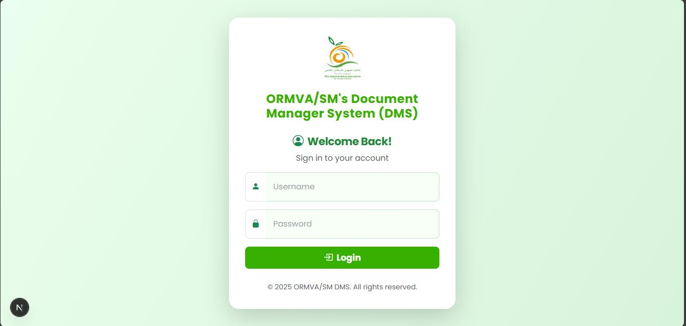

### Admin Dashboard

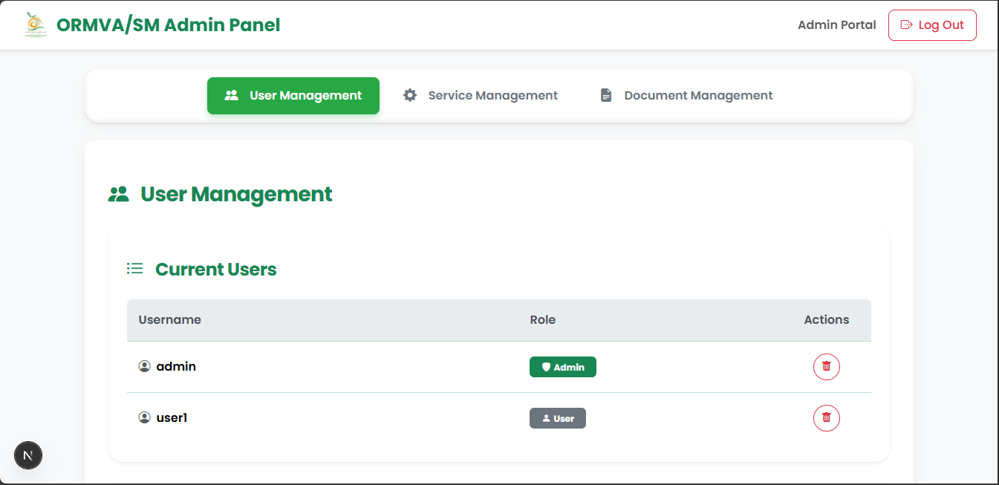

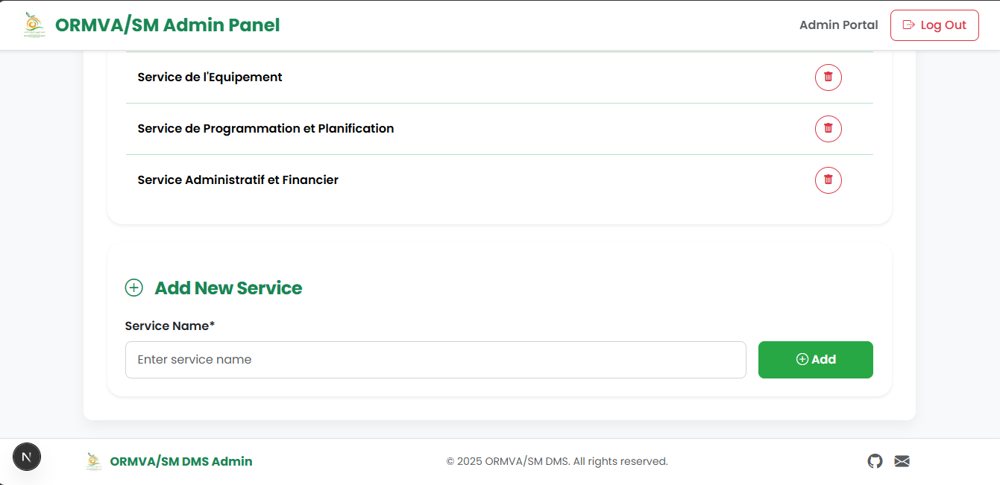

### User Dashboard

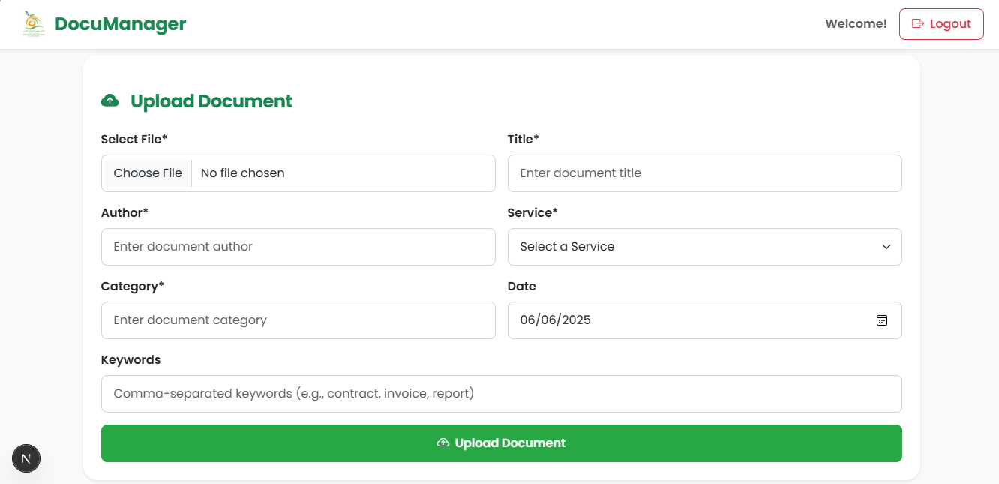

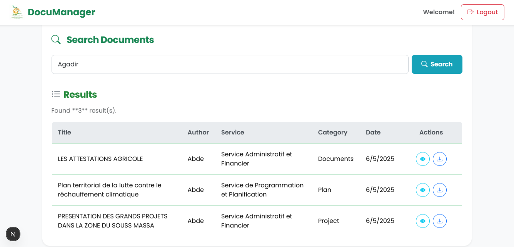

### Solr Interface

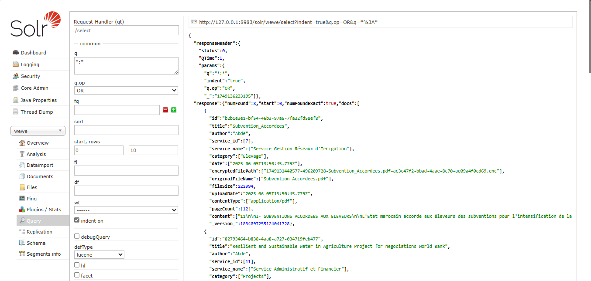

## Tech Stack

- Frontend: Next.js 15, React 19, Bootstrap 5, React Bootstrap, Bootstrap Icons, React Icons.
- Backend: Next.js API routes.
- Database: MySQL via `mysql2`.
- Search: Apache Solr via `solr-node`.
- Extraction: Apache Tika Server.
- Security: `bcryptjs`, `jsonwebtoken`, and Node `crypto` for AES-256-CBC file encryption.
- Upload handling: `multer`.

## Architecture Overview

The project follows an n-tier architecture described in the internship report:

- Presentation layer: Next.js pages for login, user dashboard, and admin dashboard.
- API/business layer: Next.js API routes for authentication, document upload/search/view, and admin CRUD operations.
- Data layer: MySQL stores users, services, and document metadata; the filesystem stores encrypted files; Solr stores searchable indexed content.
- External processing services: Apache Tika extracts content and metadata before indexing.

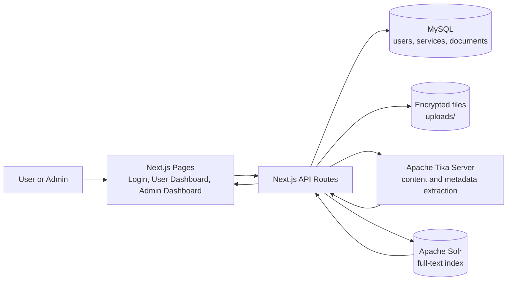

## Core Workflows

### Authentication Flow

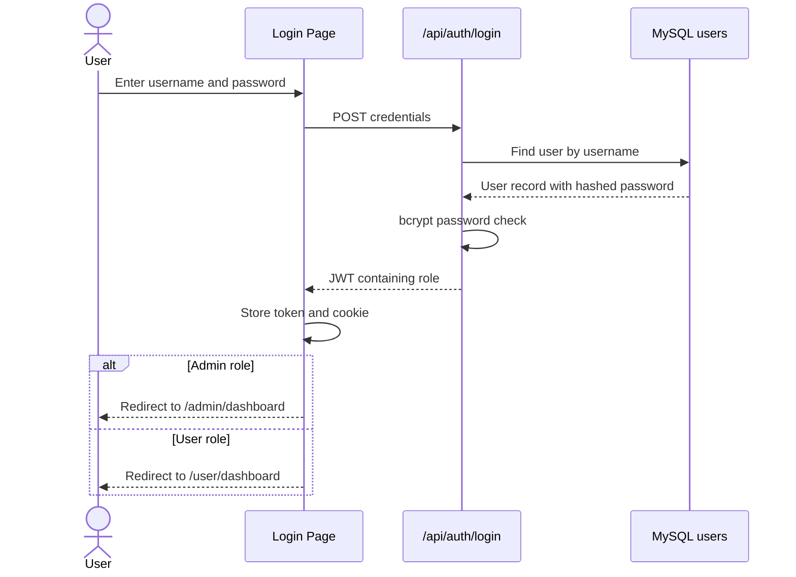

### Secure Upload and Indexing Flow

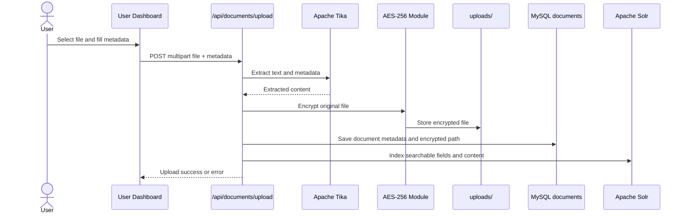

### Search, View, and Download Flow

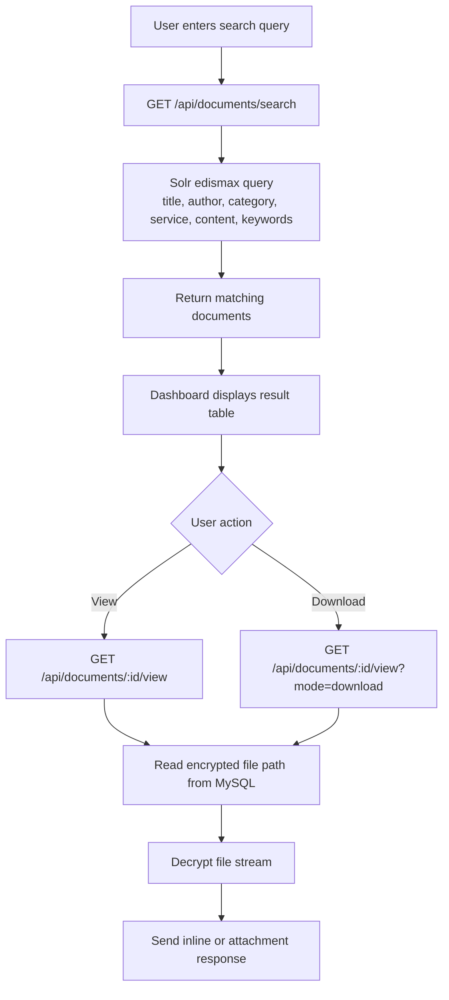

### Admin Management Flow

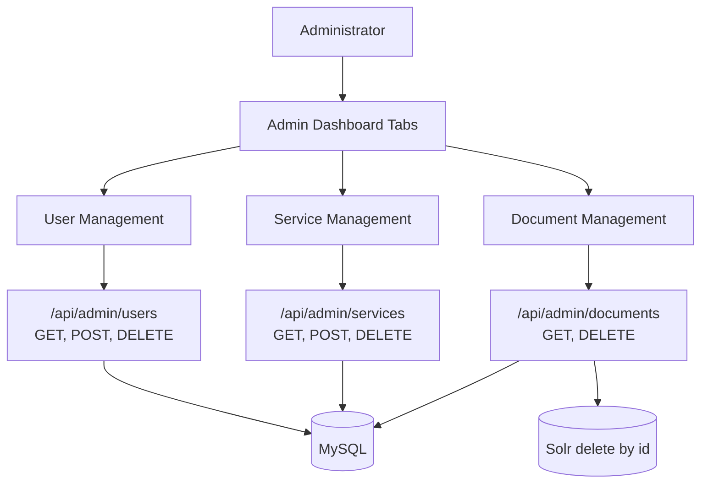

## Folder Structure

```text
.
|-- app/                         # App Router redirect and root layout
|-- components/admin/            # Admin dashboard components
|-- docs/
|   |-- database-schema.sql      # Inferred MySQL schema
|   `-- screenshots/             # README screenshot assets
|-- lib/                         # MySQL and Solr clients
|-- pages/                       # Pages Router views and API routes
|-- public/                      # Logo and favicon
|-- solr-8.11.4/                 # Local Solr distribution/config in this workspace
|-- styles/global.css            # Global UI styles
`-- uploads/                     # Local encrypted files, ignored by Git
```

## Prerequisites

- Node.js and npm.
- MySQL server.
- Apache Solr running with core `wewe` unless `SOLR_CORE` is changed.
- Apache Tika Server running on `http://localhost:9998` unless `TIKA_SERVER_URL` is changed.
- Java runtime for Solr and Tika.

Validated locally:

- `node` and `java` are installed.
- `/api/admin/services` returned data when the local app was running.
- `/api/documents/search?query=test` returned `500` while Solr was not reachable.
- Solr startup on Java 24 did not come online within 30 seconds; Java 17 is recommended for Solr 8.11.x.

## Environment Variables

Create a local `.env` from `.env.example`:

```bash
cp .env.example .env
```

| Variable | Purpose |
| --- | --- |
| `JWT_SECRET` | Secret used to sign login JWTs. |
| `ENCRYPTION_KEY` | At least 32 characters; used for AES-256 file encryption/decryption. |
| `DB_HOST`, `DB_PORT`, `DB_USER`, `DB_PASSWORD`, `DB_NAME` | MySQL connection settings. |
| `SOLR_HOST`, `SOLR_PORT`, `SOLR_CORE` | Solr connection settings. |
| `TIKA_SERVER_URL` | Base URL for Apache Tika Server. |

Never commit real `.env` values.

## Database Setup

An inferred schema is available in [`docs/database-schema.sql`](docs/database-schema.sql). It is based on the queries used by the API routes.

```bash
mysql -u root -p < docs/database-schema.sql
```

To create an initial user, generate a bcrypt hash and insert it manually:

```bash
node lib/bcrypt.js
```

To verify: `lib/bcrypt.js` currently hashes the hard-coded example password `userpassword`; update it locally or use a separate seed script before production.

## Setup and Run

```bash
npm install
cp .env.example .env
mysql -u root -p < docs/database-schema.sql
```

Start Solr and Tika in separate terminals:

```bash
solr-8.11.4/bin/solr.cmd start -p 8983
java -jar lib/tika-server-3.2.0.jar -p 9998
```

Run the app:

```bash
npm run dev
```

Open `http://localhost:3000/login`.

## Build and Deployment

```bash
npm run build
npm run start
```

Production checklist:

- Configure strong `JWT_SECRET` and `ENCRYPTION_KEY` values.
- Run behind HTTPS.
- Supervise MySQL, Solr, Tika, and Next.js as services.
- Do not commit `.env`, `uploads/`, Solr indexes, logs, or build output.
- Add server-side authorization checks to protected API routes before exposing publicly.

## API Endpoints

| Method | Endpoint | Description |
| --- | --- | --- |
| `POST` | `/api/auth/login` | Validate username/password, return JWT with role. |
| `GET` | `/api/admin/users` | List users. |
| `POST` | `/api/admin/users` | Create user with bcrypt-hashed password. |
| `DELETE` | `/api/admin/users` | Delete user by `id`. |
| `GET` | `/api/admin/services` | List services. |
| `POST` | `/api/admin/services` | Create service. |
| `DELETE` | `/api/admin/services` | Delete service by `id`. |
| `GET` | `/api/admin/documents` | List document metadata. |
| `POST` | `/api/admin/documents` | Insert document metadata manually. |
| `DELETE` | `/api/admin/documents` | Delete document metadata and remove it from Solr. |
| `POST` | `/api/documents/upload` | Upload, extract, encrypt, store, and index a document. |
| `GET` | `/api/documents/search?query=...` | Search Solr fields: title, author, category, service, content, keywords. |
| `GET` | `/api/documents/[id]/view` | Stream decrypted file inline. |
| `GET` | `/api/documents/[id]/view?mode=download` | Stream decrypted file as an attachment. |

To verify before production: most admin API routes currently do not enforce JWT or role checks server-side; the UI has a client-side cookie guard, but API authorization should be hardened.

## User Workflows

Authentication:

1. User enters credentials on `/login`.
2. API validates the password with bcrypt.
3. API returns a JWT containing the user role.
4. Frontend stores the token in `localStorage`, sets `isLoggedIn`, and redirects by role.

Standard user:

1. Open `/user/dashboard`.
2. Select a file and enter title, author, service, category, date, and optional keywords.
3. Upload the file.
4. Search documents by keyword.
5. View or download matching documents.

Administrator:

1. Open `/admin/dashboard`.
2. Manage users in the Users tab.
3. Manage organization services in the Services tab.
4. View, download, and delete documents in the Documents tab.

## Animations and Interactions

- Bootstrap alerts for errors and success messages.
- Loading spinners during upload, search, and admin data loading.
- Hover and focus states for buttons, cards, form controls, and tables.
- Admin dashboard tab switching through query parameters.
- Document action buttons for view, download, and delete.

## Future Improvements

- Server-side authorization middleware for all admin and document APIs.
- Document versioning and restore history.
- Granular permissions per service, user, or document category.
- Audit log for upload, view, download, delete, and admin actions.
- A seed script for initial admin/service data.
- Automated unit/integration tests.
- Non-interactive ESLint configuration.
- Production Solr core creation and schema migration scripts.

## Author and Internship Note

Internship/SFE project by Boudrari Abdelouahed, completed in the context of a final-year internship at ORMVASM in Agadir during the 2024-2025 academic year. The report identifies the hosting office as the Service de Programmation et de la Planification (SPP).
